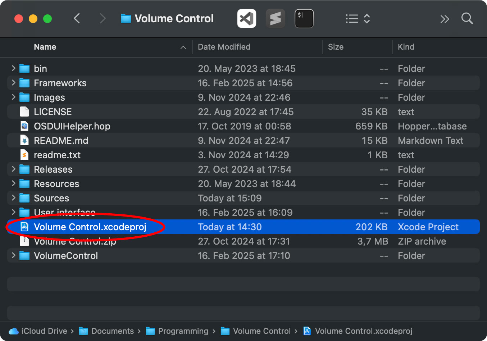
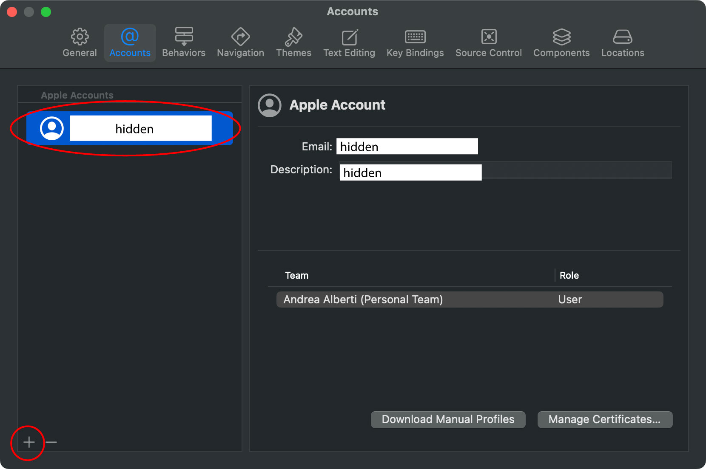
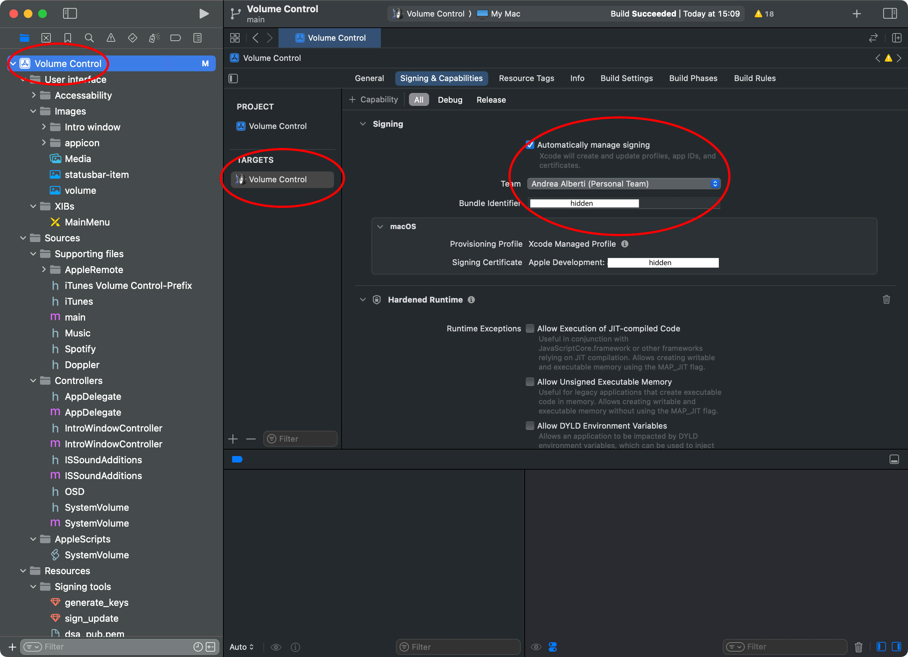
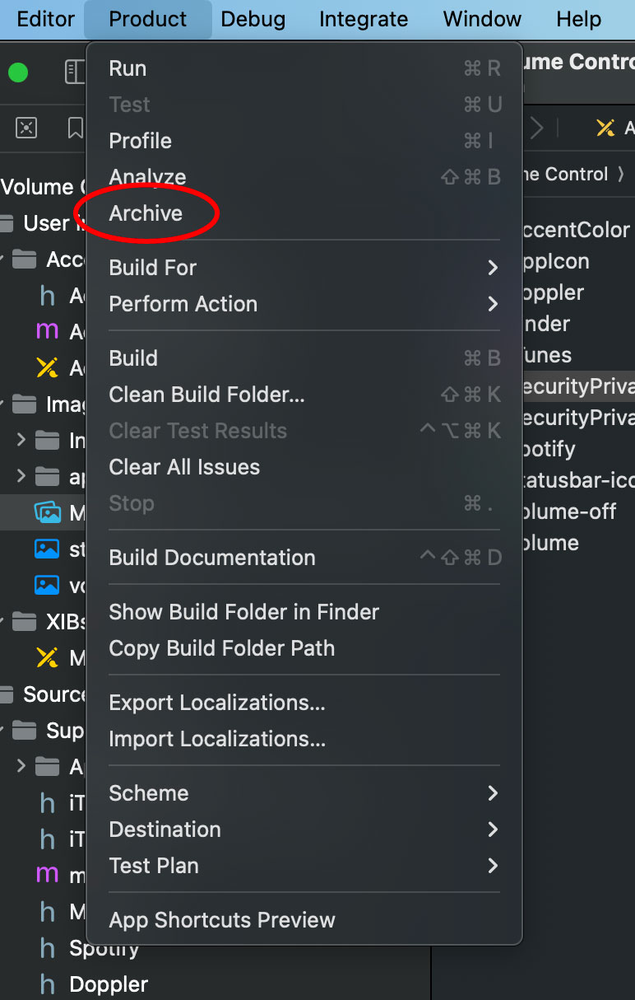

# Compiling Volume Control from Source (Xcode Guide)

**Introduction:** Recent macOS versions like Ventura (13) and the upcoming “Sequoia” have introduced stricter security measures that can prevent unsigned apps from launching. Volume Control is currently *not signed* with an official Apple Developer certificate, which means macOS might block it or show no “Open Anyway” option. Additionally, if the app’s bundle identifier doesn’t match the expected value (for example, after an update), Gatekeeper may still refuse to run it. In these cases, **compiling the app from source** with your own Apple ID and code signature is a reliable solution. This guide provides step-by-step instructions to build Volume Control on your Mac using Xcode, so you can run it without security warnings.

## Prerequisites

- **macOS**: A Mac running macOS **Ventura** (13) or newer (e.g. “Sequoia”).  
- **Xcode**: Installed from the App Store (or Apple’s developer site). Make sure Xcode is up-to-date and compatible with your macOS version.  
- **Apple ID**: An Apple ID configured in Xcode. You do **not** need a paid developer membership – a free Apple ID with a Personal Team is enough for code signing.  
- **Git**: (Optional) To clone the repository. macOS comes with Git (or Xcode’s Command Line Tools provide it). Alternatively, you can download the source as a ZIP from GitHub if you prefer.

## Step-by-Step Compilation Instructions

1. **Clone the Volume Control repository.** Open Terminal and run:  
   ```bash
   git clone https://github.com/alberti42/Volume-Control.git
   ```  
   This will download the project source code into a folder named **Volume-Control** (or you can use GitHub Desktop or download the ZIP from the GitHub page and extract it). For example, if you clone via Terminal, you should now have a `Volume-Control` directory containing files like `Volume Control.xcodeproj`.

2. **Open the project in Xcode.** Navigate to the cloned **Volume-Control** folder in Finder. You should see a file called **`Volume Control.xcodeproj`** – this is the Xcode project file. Double-click it to open the project in Xcode (you can also launch Xcode first and go to **File > Open** and select this file). This will load the Volume Control project in Xcode. You should see the project’s files and settings in Xcode’s interface.

   <br>
   <em>Finder window with <code>Volume Control.xcodeproj</code> selected, ready to be opened in Xcode.</em>

3. **Add your Apple ID account to Xcode (if not already added).** In Xcode, open **Xcode > Settings** (on macOS Ventura, Xcode’s preferences are labeled “Settings”; on older macOS it’s **Xcode > Preferences**). Go to the **Accounts** tab. If your Apple ID is not listed here, click the **“+”** button in the lower-left and choose **“Apple ID”**, then sign in with your Apple ID credentials. Once added, you should see your Apple ID in the list, and Xcode will display a **Personal Team** associated with it (usually with your name or email). This Personal Team allows you to sign apps for development.

   <br>
   <em>Xcode Settings – Accounts tab, showing an Apple ID added and a Personal Team available for code signing.</em>

4. **Select your Personal Team for code signing.** Back in the Xcode project, click on the **project name** “Volume Control” in the Project Navigator (the left sidebar). This will show the project and target settings. Ensure the **“Volume Control” target** is selected in the main pane (you can select the target from the drop-down at top left of the editor, if needed). Now click on the **Signing & Capabilities** tab for the Volume Control target. Here you will set the code signing team. Find the **Team** dropdown and select your Personal Team (the one with your name or “[Your Name] (Personal Team)”). If it’s already selected automatically, great – otherwise choose it. Keep **“Automatically manage signing”** checked, so Xcode can create a provisioning profile for you if needed.

5. **Change the bundle identifier to a unique value.** In the same **Signing & Capabilities** section, locate the **Bundle Identifier** field. By default it might be something like `com.alberti42.VolumeControl`. You **must change this** to a unique identifier that nobody else is using – typically, using your own name or domain. For example, you can click into the Bundle Identifier field and replace it with:  
   ```text
   org.<yourname>.VolumeControl
   ```  
   (Replace `<yourname>` with something unique, such as your GitHub username or your last name, etc.)  

   <br>
   <em>In Xcode’s Signing & Capabilities for the Volume Control target: selecting your Personal Team and using a custom Bundle Identifier.</em>

6. **Build the project to verify everything is set up.** Now that signing is configured, build the app. Go to **Product > Build** (or press **⌘B**) to compile Volume Control. The build should succeed (you’ll see a “Build Succeeded” message in the status bar) and Xcode will generate the app binary.

7. **Archive the app for release.** After a successful build, go to **Product > Archive** to create a release build.

    Archive menu" width="50%"><br>
   <em>In Xcode, go to <strong>Product > Archive</strong> to create a release build of the app.</em>

8. **Locate the built app.** Once archived, the Organizer window will open. Choose “Distribute” or “Export” and follow the prompts to extract the `.app` file. Alternatively, right-click on the archive in Finder → Show Package Contents → go to `Products/Applications/`.

9. **Install and run the app.** Drag the `Volume Control.app` to your **Applications** folder. Launch it — macOS should trust it since it's now signed with your own certificate.

> **Note:** Automatic updates via Sparkle won't work if the bundle identifier is changed. You'll need to manually check the GitHub repository for updates.

## Troubleshooting

- **Signing errors?** Ensure you've:
  - Added your Apple ID in Xcode → Settings → Accounts.
  - Selected your Personal Team.
  - Changed the bundle ID to something unique.
- **Archive grayed out?** Ensure your scheme is selected and the destination is “My Mac”.
- **Still blocked by macOS?** Right-click → Open to bypass Gatekeeper.

For additional help, refer to:
- [StackOverflow: Xcode signing issues](https://stackoverflow.com/questions/40113291/xcode-8-xcodebuild-how-to-trigger-update-signing-from-command-line)
- Apple Developer Forums
