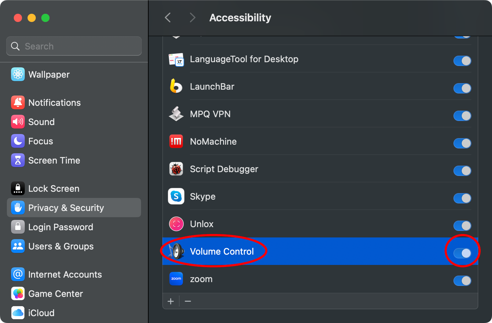
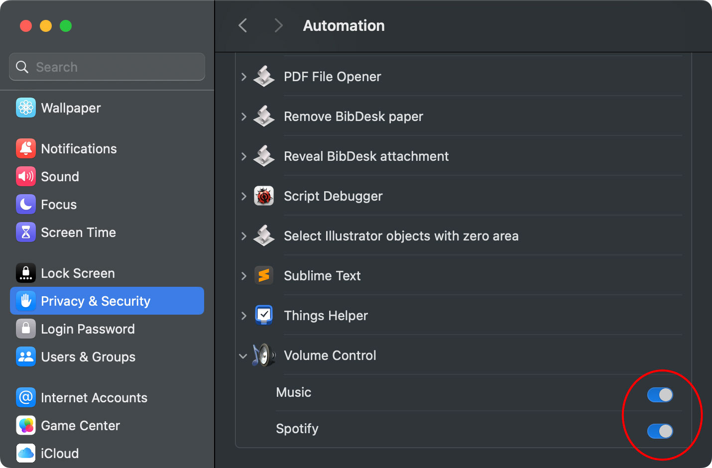

# Volume Control for macOS

♫ **Control the volume of Apple Music, Spotify, and Doppler using your keyboard — seamlessly.**

> 🚀 Now compatible with macOS Tahoe (supports Ventura and newer). 
> ✅ Fully notarized — no workarounds required to install.

This app is the spiritual successor to _iTunes Volume Control_, offering a simple yet powerful way to adjust volume for your favorite music apps directly from your keyboard — especially when listening via AirPlay or external speakers.

---

## Table of Contents

- [Features](#features)
- [Why Use This App?](#why-use-this-app)
- [Installation](#installation)
- [Permissions](#permissions)
- [Troubleshooting](#troubleshooting)
- [Requirements](#requirements)
- [Building from Source](#building-from-source)
- [Credits](#credits)
- [Donations](#donations)
- [Author](#author)
- [Versions](#versions)

---

## Features

- Control the volume of Apple Music, Spotify, and Doppler using the `volume up` and `volume down` keys.
- Especially useful when using AirPlay devices or external speakers.
- Customize the volume step size.
- Option to hide the volume bezel overlay (HUD).
- When Music or Spotify is playing, volume keys affect their volume; otherwise, they adjust system volume.
- Holding `⌘` (Command) key inverts this behavior.
- Toggle behavior with the "Use ⌘ modifier" option.

---

## Why Use This App?

- macOS does **not** allow controlling Apple Music's volume via keyboard keys — only the system volume.
- AirPlay speakers depend on **app-specific** volume, not system volume.
- This app restores fine-grained volume control directly from your keyboard.
- Avoid the intrusive volume HUD overlay when watching movies.
- Works seamlessly with Spotify and Doppler, too.

---

## Installation

1. **Download** the [latest notarized release](https://raw.githubusercontent.com/alberti42/Volume-Control/main/VolumeControl.zip).
2. **Unzip** the archive.
3. **Drag** the app into your `Applications` folder (or anywhere you like).
4. **Launch** the app.

That’s it — no extra Terminal commands or security tweaks are required. 🎉

---

## Permissions

The app requires Accessibility and Automation permissions to control other apps' volumes.

1. When prompted, allow access to control **Music** and **Spotify**.
2. If you missed it or need to reset:
   - Go to **System Settings → Privacy & Security → Accessibility**
   - Remove and re-add _Volume Control_.
   - Also check **Automation** and ensure both Music and Spotify are enabled.

---

## Requirements

- macOS **Ventura (13.5)** or later (Sonoma, Sequoia, Tahoe)
- Intel or Apple Silicon Macs
- Accessibility and Automation permissions granted

---

## Building from Source

If you prefer or need to compile the app yourself using Xcode, see the instructions 👉 [here](Docs/Compile.md).

---

## Credits

- Inspired by _Volume for iTunes_ by **Yogi Patel**
- Icon design by **Alexandro Rei**
- Apple Remote integration adapted from `iremotepipe` by **Steven Wittens**
- Native HUD overlay by **Benno Krauss** and reverse-engineered use of `OSDUIHelper`
- Doppler support by **Ed Wellbrook**

---

## Donations

If this app improves your workflow, consider supporting development:

Or click here: 

---

## Author

**Andrea Alberti**
GitHub: [@alberti42](https://github.com/alberti42)

---

## Versions

You can download older versions here:

- [2.1.0](https://raw.githubusercontent.com/alberti42/Volume-Control/main/Releases/VolumeControl-v2.1.0.zip): Brought back HUD for volume indication in Tahoe.
- [2.0.1](https://raw.githubusercontent.com/alberti42/Volume-Control/main/Releases/VolumeControl-v2.0.1.zip): Fixed a bug preventing controlling volume of music players.
- [2.0.0](https://raw.githubusercontent.com/alberti42/Volume-Control/main/Releases/VolumeControl-v2.0.0.zip): Notarized and compatible with Tahoe. Many improvements under the hood.
- [1.7.7](https://raw.githubusercontent.com/alberti42/Volume-Control/main/Releases/VolumeControl-v1.7.7.zip): Added option for locking system and player volumes together.
- [1.7.6](https://raw.githubusercontent.com/alberti42/Volume-Control/main/Releases/VolumeControl-v1.7.6.zip): Fixes some bugs with the volume not reaching zero.
- [1.7.5](https://raw.githubusercontent.com/alberti42/Volume-Control/main/Releases/VolumeControl-v1.7.5.zip): Universal application compiled to run natively on both Apple Silicon and Apple Intel.
- [1.7.4](https://raw.githubusercontent.com/alberti42/Volume-Control/main/Releases/VolumeControl-v1.7.4.zip): Added support for Doppler Music Player thanks to Ed Wellbrook.
- [1.7.3](https://raw.githubusercontent.com/alberti42/Volume-Control/main/Releases/VolumeControl-v1.7.3.zip): Made acoustic feedback when changing volume more responsive. Fixed minor bugs. Switch to updates through GitHub repository.
- [1.7.2](https://raw.githubusercontent.com/alberti42/Volume-Control/main/Releases/VolumeControl-v1.7.2.zip): Fixed appearance of icon according to Monterey MacOS style.
- [1.7.0](https://raw.githubusercontent.com/alberti42/Volume-Control/main/Releases/VolumeControl-v1.7.0.zip): Changed name to Volume Control; compatibility with Big Sur; compiled for universal bundle for Apple M1 and Intel.
- [1.6.8](https://raw.githubusercontent.com/alberti42/Volume-Control/main/Releases/iTunesVolumeControl-v1.6.8.zip): Fixed a bug when switching appearance to dark mode; improved volume control with apple key modifier.
- [1.6.7](https://raw.githubusercontent.com/alberti42/Volume-Control/main/Releases/iTunesVolumeControl-v1.6.7.zip): Improved compatibility with Catalina and new Music app.
- [1.6.6](https://raw.githubusercontent.com/alberti42/Volume-Control/main/Releases/iTunesVolumeControl-v1.6.6.zip): Restored compatibility with MacOS High Sierra and subsequent versions.
- [1.6.5](https://raw.githubusercontent.com/alberti42/Volume-Control/main/Releases/iTunesVolumeControl-v1.6.5.zip): Fixed a bug to avoid launching Spotify and iTunes at start of the app, if these program are not already running.
- [1.6.4](https://raw.githubusercontent.com/alberti42/Volume-Control/main/Releases/iTunesVolumeControl-v1.6.4.zip): Fixed crash on start due to failed permissions for AppleEvents.
- [1.6.3](https://raw.githubusercontent.com/alberti42/Volume-Control/main/Releases/iTunesVolumeControl-v1.6.3.zip): Removed codesigning that was causing the app to crash when starting.
- [1.6.2](https://raw.githubusercontent.com/alberti42/Volume-Control/main/Releases/iTunesVolumeControl-v1.6.2.zip): Fixed bug preventing Spotify's volume to be controlled.
- [1.6.1](https://raw.githubusercontent.com/alberti42/Volume-Control/main/Releases/iTunesVolumeControl-v1.6.1.zip): Improved visualization of volume status using even marks.
- [1.6.0](https://raw.githubusercontent.com/alberti42/Volume-Control/main/Releases/iTunesVolumeControl-v1.6.0.zip): Able to control Spotify, iTunes, and main volume.
- [1.5.3](https://raw.githubusercontent.com/alberti42/Volume-Control/main/Releases/iTunesVolumeControl-v1.5.3.zip): Made use of Mojave's native heads-up display to show the volume status.
- [1.5.2](https://raw.githubusercontent.com/alberti42/Volume-Control/main/Releases/iTunesVolumeControl-v1.5.2.zip): Fixed compatibility with Mojave. Prior versions are no longer supported. Fixed small bug on displaying the volume level when controlling it with the Apple Remote.
- [1.5.1](https://raw.githubusercontent.com/alberti42/Volume-Control/main/Releases/iTunesVolumeControl-v1.5.1.zip): Added the compatibility with Mac OS X versions greater than OS X 10.7 (Lion).
- [1.5](https://raw.githubusercontent.com/alberti42/Volume-Control/main/Releases/iTunesVolumeControl-v1.5.zip): Added the possibility to change the increment step on the volume. Backward compatible with Mavericks and Yosemite.
- [1.4.10](https://raw.githubusercontent.com/alberti42/Volume-Control/main/Releases/iTunesVolumeControl-v1.4.10.zip): Corrected bug on repositioning the volume indicator on right position.
- [1.4.9](https://raw.githubusercontent.com/alberti42/Volume-Control/main/Releases/iTunesVolumeControl-v1.4.9.zip): Started to prepare the transition to Yosemite look.
- [1.4.8](https://raw.githubusercontent.com/alberti42/Volume-Control/main/Releases/iTunesVolumeControl-v1.4.8.zip): Updates are now signed with DSA. This improves the security, e.g., preventing man-in-the-middle attacks.
- [1.4.7](https://raw.githubusercontent.com/alberti42/Volume-Control/main/Releases/iTunesVolumeControl-v1.4.7.zip): Changed icons and graphics to be compatible with retina display.
- [1.4.6](https://raw.githubusercontent.com/alberti42/Volume-Control/main/Releases/iTunesVolumeControl-v1.4.6.zip): Added the option to hide the icon from status bar. The icon reappears temporarily (for 10 seconds) by simply restarting the application. This gives the time to change the hide behavior as desired.
- [1.4.5](https://raw.githubusercontent.com/alberti42/Volume-Control/main/Releases/iTunesVolumeControl-v1.4.5.zip): Added the option to enable/disable automatic updates occurring once a week
- [1.4.4](https://raw.githubusercontent.com/alberti42/Volume-Control/main/Releases/iTunesVolumeControl-v1.4.4.zip): Corrected two bugs: the focus remains correctly on the selected application after changing the volume; cap lock does not prevent anymore the volume to be changed.
- [1.4.3](https://raw.githubusercontent.com/alberti42/Volume-Control/main/Releases/iTunesVolumeControl-v1.4.3.zip): Corrected bug: properly hide transparent panels when animations are completed (thanks to Justin Kerr Sheckler)
- [1.4.2](https://raw.githubusercontent.com/alberti42/Volume-Control/main/Releases/iTunesVolumeControl-v1.4.2.zip): Added iTunes icon to volume indicator. Corrected bug when iTunes is busy.
- [1.4.1](https://raw.githubusercontent.com/alberti42/Volume-Control/main/Releases/iTunesVolumeControl-v1.4.1.zip): Added automatic upgrade capability.
- 1.4: Added "mute" control.
- 1.3: Added graphic overlay panel indicating the volume level.
- 1.2: Added options, load at login, use CMD modifier.
- 1.1: Controlling iTunes volume using Apple Remote.
- 1.0: Controlling iTunes volume using keyboard "volume up"/"volume down".

---

> 💡 Found a bug or want to contribute? Open an [issue](https://github.com/alberti42/Volume-Control/issues) or submit a pull request!
